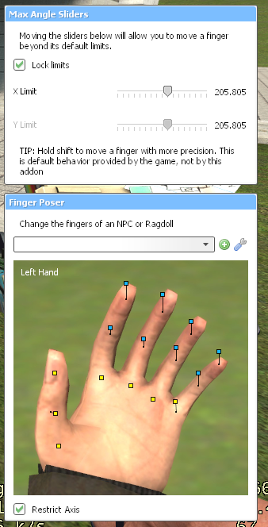

# Finger Angle Sliders <!-- omit from toc -->

Increase the limits of your character's fingers

## Table of Contents <!-- omit from toc -->

- [Description](#description)
  - [Features](#features)
  - [Rational](#rational)
  - [Remarks](#remarks)
- [Pull Requests](#pull-requests)

## Description

This adds a floating Max Angle Slider menu above the Finger Poser context menu. This allows the user to extend a finger beyond the default angle limits. These sliders are available as the convars `finger_max_x` and `finger_max_y`

This also adds a tip for more precise finger posing, which is not documented directly in the tool itself

### Features

- **Exposed angles as sliders**: Change the finger poser limits, with an option to change the limits of both sliders at once

### Rational

The Finger Poser comes with a hardcoded limit of 100 degrees on the finger's x and y axes. To bypass this limit, users may need to use another addon like Ragdoll Mover. However, this does not allow users to take advantage of the Finger Poser's preset system.

Previously, users would have to change the hardcoded values in `lua/vgui/fingervar.lua`. [Enhanced Fingerposer](https://steamcommunity.com/sharedfiles/filedetails/?id=3618131662) increases these limits, but this addon does not allow additional customizability beyond that. This addon fills that role by adding convars and exposing them to the user to change for their character

### Remarks

Rather than change the Finger Poser tool itself, this tool adds new UI. This allows developers to make custom Finger Poser tool overrides

**This addon overrides the `lua/vgui/fingervar.lua` file.** This is incompatible with addons that replace this file, especially the [Enhanced Fingerposer](https://steamcommunity.com/sharedfiles/filedetails/?id=3618131662) addon

## Pull Requests

When making a pull request, make sure to confine to the style seen throughout. Try to add types for new functions or data structures. I used the default [StyLua](https://github.com/JohnnyMorganz/StyLua) formatting style.
